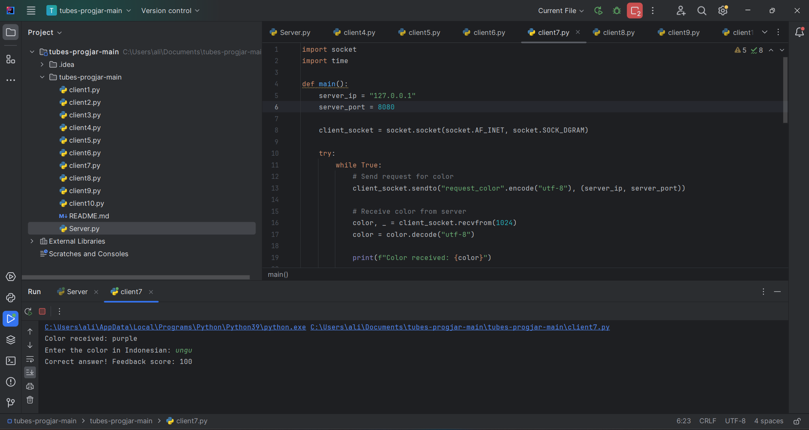

<a href="https://git.io/typing-svg"></a>
```
Nama : Ali Rafli Putra Hakiki
NIM : 1203220107
Kelas : IF-02-01
```
<a href="https://git.io/typing-svg"></a>
<hr>
Buatlah sebuah permainan yang menggunakan soket dan protokol UDP. Permainannya cukup sederhana, dengan 1 server dapat melayani banyak klien (one-to-many). Setiap 10 detik, server akan mengirimkan kata warna acak dalam bahasa Inggris kepada semua klien yang terhubung. Setiap klien harus menerima kata yang berbeda (unik). Selanjutnya, klien memiliki waktu 5 detik untuk merespons dengan kata warna dalam bahasa Indonesia. Setelah itu, server akan memberikan nilai feedback 0 jika jawabannya salah dan 100 jika benar.
<br>
<a href="https://git.io/typing-svg"></a>
<a href="https://git.io/typing-svg"></a>

```python
import socket
import random

SERVER_IP = "127.0.0.1"
SERVER_PORT = 12345
BUFFER_SIZE = 1024
COLORS = ["red", "green", "blue", "yellow", "pink", "purple", "brown", "cyan", "maroon"]

def generate_random_color():
    return random.choice(COLORS)

def handle_client_request(server_socket, client_address):
    color = generate_random_color()
    server_socket.sendto(color.encode("utf-8"), client_address)
    print(f"Sent color {color} to {client_address}")

def main():
    server_socket = socket.socket(socket.AF_INET, socket.SOCK_DGRAM)
    server_socket.bind((SERVER_IP, SERVER_PORT))

  print(f"Server running on {SERVER_IP}:{SERVER_PORT}")

  try:
        while True:
            data, client_address = server_socket.recvfrom(BUFFER_SIZE)
            data = data.decode("utf-8")

  if data == "request_color":
                handle_client_request(server_socket, client_address)

  except KeyboardInterrupt:
        print("\nServer stopped.")

  finally:
        server_socket.close()

if __name__ == "__main__":
    main()
```

### Import :
<p>import socket: Modul ini memberikan akses ke antarmuka soket BSD. Ini memungkinkan pembuatan koneksi jaringan.</p>
<p>import random: Modul ini memungkinkan kita untuk menghasilkan angka acak. Kami akan menggunakannya untuk memilih warna acak dari daftar yang telah ditentukan sebelumnya.</p>

### Conts :
<p>SERVER_IP dan SERVER_PORT: Mendefinisikan alamat IP dan nomor port di mana server akan mendengarkan koneksi masuk.</p>
<p>BUFFER_SIZE: Menentukan ukuran maksimum paket data yang dapat diterima oleh server sekaligus.</p>
<p>COLORS: Daftar berbagai warna. Secara acak memilih salah satu warna ini untuk dikirim kembali ke klien.</p>

### Function :
<p><b>generate_random_color():</b> Fungsi ini bertanggung jawab untuk memilih warna acak dari daftar COLORS dan mengembalikannya.</p>
<p><b>handle_client_request(server_socket, client_address):</b> Fungsi ini menangani permintaan klien. Ini menghasilkan warna acak menggunakan generate_random_color() dan mengirimkannya kembali ke klien.</p>

### Main Function :
<p><b>def main():</b> Main. </p>
<p><b>server_socket = socket.socket(socket.AF_INET, socket.SOCK_DGRAM) : </b> Fungsi ini digunakan untuk membuat objek socket untuk komunikasi. socket.AF_INET menunjukkan bahwa kita akan menggunakan alamat IP versi 4 (IPv4), dan socket.SOCK_DGRAM menunjukkan bahwa kita akan menggunakan protokol UDP untuk komunikasi.</p>
<p><b>server_socket.bind((SERVER_IP, SERVER_PORT)) : </b>  Fungsi ini digunakan untuk mengikat socket server ke alamat dan port yang ditentukan. SERVER_IP dan SERVER_PORT adalah konstanta yang sudah ditentukan sebelumnya, yang menentukan alamat IP dan port di mana server akan mendengarkan permintaan masuk.</p>
<p><b>print(f"Server running on {SERVER_IP}:{SERVER_PORT}") : </b>Merupakan fungsi untuk print alamat server terkoneksi.</p>
<p><b>try:</b> menangkap semua kemungkinan pengecualian yang terjadi di dalamnya. </p>
<p><b>while True:</b> Merupakan loop tak terbatas yang akan terus berjalan selama kondisinya selalu bernilai True. Dalam konteks ini, ini berarti server akan terus menerima dan menanggapi permintaan klien tanpa henti.</p>
<p><b>data, client_address = server_socket.recvfrom(BUFFER_SIZE) : </b> Fungsi ini menerima data dari klien dan juga menangkap alamat klien. recvfrom() mengembalikan data yang diterima dari klien serta alamat klien yang mengirim data tersebut. Data yang diterima disimpan dalam variabel data, sedangkan alamat klien disimpan dalam variabel client_address</p>
<p><b>data = data.decode("utf-8") : </b> Data yang diterima dari klien biasanya dalam bentuk byte. Fungsi ini mendekode data tersebut dari byte menjadi string menggunakan metode .decode("utf-8"). Ini diperlukan agar kita dapat bekerja dengan data dalam format string.</p>
<p><b> if data == "request_color":
                handle_client_request(server_socket, client_address) : </b> Memeriksa apakah data yang diterima dari klien adalah string "request_color". Jika benar, maka itu berarti klien meminta untuk mengirimkan warna acak.</p>
<p><b>except KeyboardInterrupt:
        print("\nServer stopped.")</b> Pengecualian yang ditentukan untuk menangkap pengecualian yang dihasilkan ketika pengguna menekan tombol Ctrl+C. Pengecualian ini disebut KeyboardInterrupt, dan mencetak pesan "Server stopped." di layar. Pesan ini memberi tahu pengguna bahwa server telah berhenti dengan benar setelah menekan Ctrl+C.</p>
<p><b>finally : </b> Akan dieksekusi, terlepas dari apakah ada pengecualian yang terjadi atau tidak. Di dalamnya, kita menutup socket server menggunakan <b>server_socket.close()</b>. Ini penting untuk memastikan bahwa sumber daya yang digunakan oleh socket server dibebaskan dengan benar setelah server dihentikan.</p>
<p><b>if __name__ == "__main__" : </b> Ini adalah kondisi yang akan dievaluasi sebagai True jika skrip dijalankan langsung oleh Python, bukan diimpor sebagai modul ke skrip lain. Jika kondisi tersebut terpenuhi, maka fungsi main() akan dipanggil, yang pada gilirannya memulai eksekusi utama dari program.</p>
<a href="https://git.io/typing-svg"></a>

```python
import socket
import time

def main():
    server_ip = "127.0.0.1"
    server_port = 8080

    client_socket = socket.socket(socket.AF_INET, socket.SOCK_DGRAM)

    try:
        while True:
            # Send request for color
            client_socket.sendto("request_color".encode("utf-8"), (server_ip, server_port))

            # Receive color from server
            color, _ = client_socket.recvfrom(1024)
            color = color.decode("utf-8")

            print(f"Color received: {color}")

            # Prompt user for translation
            response = input("Enter the color in Indonesian: ")

            # Translate color and check correctness
            indonesian_color = english_to_indonesian_color(color)
            if response.lower() == indonesian_color:
                print("Correct answer! Feedback score: 100")
            else:
                print("Wrong answer. Feedback score: 0")

            # Wait before sending another request
            time.sleep(10)

    except KeyboardInterrupt:
        print("\nClient stopped.")

    finally:
        client_socket.close()
def english_to_indonesian_color(english_color):
    color_mapping = {
        "red": "merah",
        "green": "hijau",
        "blue": "biru",
        "yellow": "kuning",
        "pink": "merah-muda",
        "purple": "ungu",
        "brown": "coklat",
        "cyan":"sian",
        "maroon":"merah-marun"
    }
    return color_mapping.get(english_color.lower(), "can't find specified colors")

if __name__ == "__main__":
    main()
```

<a href="https://git.io/typing-svg"></a>
- Program dimulai dengan mengimpor modul `socket` dan `time`.
-  `main()` merupakan fungsi utama program.
- IP server diatur sebagai `"127.0.0.1"` (localhost), dan port server diatur sebagai `8080`.
- Socket Client dibuat menggunakan `socket.AF_INET` untuk alamat IPv4, dan `socket.SOCK_DGRAM` untuk protokol UDP.
- Lalu Client mengirim permintaan `"request_color"` ke server.
- Kemudian Client menerima warna dari server, dan mendekode data yang diterima.
- Client menampilkan warna yang diterima dari server.
- Pengguna diminta memasukkan jawaban warna dalam bahasa Indonesia.
- Kemudian Client membandingkan jawaban pengguna dengan terjemahan warna Inggris ke bahasa Indonesia.
- Terakhir Jika pengguna menekan `Ctrl+C`, maka program akan berhenti dan socket klien ditutup.

<br>
<a href="https://git.io/typing-svg"></a>

- Program dimulai dengan menginisialisasi alamat IP server (`server_ip`), dan port server (`server_port`).
- Lalu Socket server dibuat menggunakan `socket.AF_INET` untuk alamat IPv4, dan `socket.SOCK_DGRAM` untuk protokol UDP.
- Kemudian Server diikat ke alamat IP dan port yang telah ditentukan menggunakan `server_socket.bind((server_ip, server_port))`.
- Lalu Set `connected_clients` digunakan untuk melacak alamat klien yang terhubung.
- Selama program berjalan, server menerima data dari klien dan memprosesnya.
- Jika data yang diterima adalah `"request_color"`, maka server akan memanggil fungsi `generate_random_color()` untuk menghasilkan warna acak.
- Lalu Warna dikirim kembali ke klien yang meminta menggunakan `server_socket.sendto(color.encode("utf-8"), client_address)`.
- Terakhir Jika pengguna menekan `Ctrl+C`, maka program akan berhenti dan socket server ditutup menggunakan `server_socket.close()`.

<br>

<a href="https://git.io/typing-svg"></a>

- Program dimulai dengan menginisialisasi alamat IP server (`server_ip`) dan port server (`server_port`).
- Lalu Socket client dibuat menggunakan `socket.AF_INET` untuk alamat IPv4, dan `socket.SOCK_DGRAM` untuk protokol UDP.
- Client mengirim permintaan `"request_color"` ke server menggunakan `client_socket.sendto("request_color".encode("utf-8"), (server_ip, server_port))`.
- Kemudian Client menerima warna dari server dan mendekode data yang diterima menggunakan `color, server_address = client_socket.recvfrom(1024)`.
- Client menampilkan warna yang diterima dari server.
- Pengguna diminta memasukkan warna dalam bahasa Indonesia.
- Client membandingkan jawaban pengguna dengan terjemahan warna Inggris ke bahasa Indonesia menggunakan fungsi `english_to_indonesian_color()`.
- Terakhir Jika pengguna menekan `Ctrl+C`, maka program akan berhenti dan socket klien ditutup menggunakan `client_socket.close()`.

<br>
<a href="https://git.io/typing-svg"></a>


<br>
<a href="https://git.io/typing-svg"></a>





        
